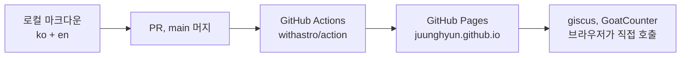

# 개인 테크 블로그 PRD

2026-09-21 · 이정현

## 1. 목적과 성공 기준

이 블로그는 백엔드 개발자가 일하며 얻은 인사이트와 문제 해결 과정을 자기 언어로 기록하고 공유하는 곳이다. GitHub 계정 아래에 두고, 블로그 자체도 계속 발전시키는 프로젝트로 다룬다.

**세 가지 목적**

- 기록: 해결한 문제와 그 과정을 남겨 미래의 내가 다시 찾게 한다.
- 정리: 남에게 설명할 수 있을 만큼 정리하는 과정에서 이해가 깊어진다. 글쓰기 자체가 인사이트를 만든다.
- 공유: 같은 문제를 검색으로 만난 개발자가 답을 얻고, 댓글과 반응으로 대화가 생긴다.

**하지 않는 것**

- 회사 내부 정보, 고객 데이터, 미공개 제품 사양은 다루지 않는다. 일반화한 패턴만 쓴다.
- 뉴스 큐레이션이나 남의 튜토리얼 번역은 하지 않는다. 직접 겪고 확인한 것만 쓴다.
- 광고 수익화는 목표가 아니다.

**성공 기준**: 1년 뒤(2027-09) 꾸준히 발행되고 있고, 검색으로 들어온 독자가 댓글이나 반응을 남기고, 블로그 코드가 한 번 이상 구조적으로 발전해 있으면 성공이다. 수치 기준은 8절 측정 지표에 둔다.

## 2. 필자와 독자

필자는 Kotlin/Spring 백엔드 개발자다. 건설 현장 계측·안전 모니터링 SaaS의 메인 백엔드를 맡아 MySQL·MongoDB·Redis·Kafka·AWS Batch 위에서 도메인 로직, 배치, 이벤트 파이프라인, 보고서 생성을 다룬다. AI 코딩 도구를 워크플로우에 깊게 넣어 쓰고, 코드 리뷰와 실패 패턴을 체계화하는 데 관심이 많다. GitHub 핸들은 juunghyun이다.

글은 한국어와 영어로 함께 발행한다(인터뷰 1라운드 결정). 그래서 독자는 국내에 한정되지 않는다.

| 독자 | 찾아오는 상황 | 원하는 것 | 블로그가 줄 것 |
| --- | --- | --- | --- |
| 검색으로 온 백엔드 개발자 | 같은 에러나 설계 고민을 검색 | 원인·해결·재현 조건 | 문제→원인→해결→교훈 구조, 복사 가능한 코드, 검증 방법 |
| 영어권 개발자 | 같은 검색을 영어로 | 위와 같음 | 한 글에 대응하는 영어판, 언어 전환 링크 |
| 동료·지인 | 링크로 공유받음 | 맥락 있는 설명 | 시리즈 묶음, 배경 글 링크 |
| 채용 담당자·미래 동료 | 프로필에서 링크를 타고 옴 | 어떤 문제를 어떻게 푸는 사람인지 | About 페이지, 대표 글 고정, 프로젝트 목록 |
| 미래의 나 | 같은 문제를 다시 만남 | 그때의 결정과 이유 | 검색, 태그, 날짜와 버전 명시 |

독자 대부분은 검색으로 글 한 편에 바로 착지한다. 그래서 메인 페이지보다 글 페이지 한 장이 혼자 설 수 있어야 한다.

### 2.1 참고 사례에서 본 공통점

국내 9명, 해외 8명의 개발자 블로그 17건을 2026-09-21에 비교했다. 다섯 가지 공통점이 PRD 결정에 반영됐다.

| 공통점 | 근거 | 반영 |
| --- | --- | --- |
| 원문은 자기가 소유한 곳에 둔다 | 명시된 12건이 정적 생성기(Jekyll 2, Hugo 1, Gatsby 2) 또는 GitHub Pages·Cloudflare Pages. 상용 플랫폼만 쓰는 경우는 Tistory 2, LinkedIn 1 | 5절 Astro + GitHub Pages 그대로 |
| 개인 도메인이 표준이다 | 해외 8명 중 7명, 국내 9명 중 3명. Substack을 써도 자기 도메인을 붙인다 | 도메인 결정을 Phase 1로 당김 (4절, 7절, 9절) |
| 구독 채널을 둔다 | 해외 8명 중 6명이 이메일 구독·뉴스레터·RSS 운영. 국내 사례엔 언급 없음 | 구독을 Should로 올림 (4절) |
| 프로필 허브에서 소속·경력·블로그를 잇는다 | 8명이 GitHub 프로필이나 About에 회사·직군을 적고 블로그를 링크 | About 페이지에 소속·경력 명시 (4절) |
| 주제는 본업 × AI | 17명 중 10명이 AI 에이전트·LLM·MCP 글을 본업 위에 얹음 | 3.1 도구·워크플로우 유형 유지, 비중은 실측 후 조정 |

원문과 배포를 나누는 패턴(Hugo 원문 + Substack 배포, Medium·Hashnode·DEV.to 병행)도 흔해 3.3에 배포 단계를 넣었다. 블로그 제작 후기와 플랫폼 이전 회고가 글감이 되는 사례(Hudi, Lalit Maganti)도 있어 첫 글 후보로 삼는다. 댓글·반응을 언급한 사례는 없었다. 독자 관계는 구독으로 유지하는 쪽이 일반적이며, giscus는 비용이 거의 없으므로 Must를 유지한다.

## 3. 콘텐츠 전략

격주 1편, 한국어와 영어 두 벌을 같은 날 발행한다. 글은 네 유형 중 하나이고, 대부분은 문제 해결 기록이다. 리듬은 8절 지표의 분모이며 분기마다 실측을 보고 조정한다.

### 3.1 글 유형

| 유형 | 구조 | 비중 | 예시 소재 |
| --- | --- | --- | --- |
| 문제 해결 기록 | 증상, 재현 조건, 원인, 해결, 교훈 | 60% | JPA 영속성 컨텍스트가 비워져 변경이 유실된 사례, 보상 트랜잭션의 전파 속성 선택, 메트릭이 조용히 필터링된 사례 |
| 설계 결정 | 선택지, 얻는 것과 잃는 것, 결정, 결과 | 20% | 배치와 이벤트 중 무엇으로 보고서를 만들지, 카운터를 어디에 둘지 |
| 실측·실험 | 질문, 방법, 수치, 해석 | 10% | LLM 단가 비교, PR 리뷰 지적 유형 분석 |
| 도구·워크플로우 | 문제, 도구, 설정, 효과 | 10% | AI 코딩 도구를 리뷰 절차에 넣은 방법 |

### 3.2 분류와 글 메타데이터

카테고리는 글 유형 4개다. 태그는 기술 이름이고(Kotlin, Spring, JPA, Kafka, MySQL, MongoDB, Redis, AWS, Claude Code), 시리즈는 순서 있는 연재 묶음이다. 한국어와 영어 글은 같은 슬러그를 쓴다.

```yaml
title: 영속성 컨텍스트가 비워지면 변경이 사라진다
description: 한 두 문장 요약. 검색 결과와 OG에 쓰인다
pubDatetime: 2026-10-05
modDatetime: 2026-10-05
lang: ko
slug: jpa-clear-automatically-lost-update
type: troubleshooting
tags: [Kotlin, Spring, JPA]
series: jpa-pitfalls
seriesOrder: 1
draft: false
```

### 3.3 글쓰기 워크플로우 (2주 사이클)


소재는 일하다 마주친 문제를 그날 이슈로 남기는 데서 시작한다. 번역은 본인이 직접 영어로 옮긴 뒤 윤문한다(2026-09-21 결정). Claude Code는 용어·수치·링크 대조와 발행 체크리스트만 맡는다.

| 주차 | 할 일 | 산출물 |
| --- | --- | --- |
| 1주 | 소재 고르기, 한국어 초안, 코드 실행 확인 | 한국어 초안, 검증된 코드 |
| 2주 | 윤문, 영어 번역과 검수, OG 확인, PR | 영어판, PR 머지, 동시 발행 |
| 발행 직후 | LinkedIn에 요약과 원문 링크, 구독 채널 발송 | 배포 글 1건, 구독 발송 1회 |

발행 전 체크리스트

- [ ] 회사 내부 정보, 고객명, 내부 URL이 없다. 코드는 재작성본이다.
- [ ] 코드를 실행해 확인했고 언어·프레임워크 버전을 적었다.
- [ ] 제목에 독자가 검색할 단어가 들어 있다.
- [ ] 한·영 슬러그가 같고 서로 링크된다.
- [ ] description이 한두 문장이고 OG 이미지를 확인했다.

## 4. 기능 요구사항

Phase 1은 Must 전부를 갖추고 연다. 우선순위는 MoSCoW(Must, Should, Could, Won't)다. Phase 1 필수 기능 네 개(조회수·검색·시리즈·About)는 인터뷰 2라운드에서 정했다.

| 기능 | 우선순위 | Phase | 구현 수단 | 완료 기준 |
| --- | --- | --- | --- | --- |
| 글 목록, 글 페이지, 페이지네이션 | Must | 1 | AstroPaper 기본 | 글 3편이 목록과 상세에 보인다 |
| 마크다운·MDX, 코드 하이라이트 | Must | 1 | Astro 내장 Shiki, 줄 강조·파일명 | Kotlin·SQL·YAML 하이라이트, 가로 스크롤 |
| 목차 | Must | 1 | AstroPaper 접이식 목차 | h2·h3 자동 생성 |
| 한/영 전환, hreflang | Must | 1 | Astro i18n + 레이아웃 link 태그 + sitemap i18n | 두 언어 페이지가 서로 가리킨다 |
| 댓글 | Must | 1 | giscus | GitHub 로그인 후 댓글, 다크모드 연동 |
| 반응 | Must | 1 | giscus 반응 | 글 하단에 반응 수 표시 |
| 글별 공개 조회수 | Must | 1 | GoatCounter counter JSON | 글 상단 숫자, 4시간 지연 허용 |
| 방문자 분석 | Must | 1 | GoatCounter 대시보드 | 유입 경로·페이지별 집계 |
| 사이트 내 검색 | Must | 1 | Pagefind (AstroPaper 내장) | 한글 검색어로 결과가 나온다 |
| 태그, 시리즈 | Must | 1 | 태그는 테마, 시리즈는 프런트매터 + 목록 컴포넌트 | 시리즈 글에 이전·다음 링크 |
| About, 프로젝트 | Must | 1 | 정적 페이지 2개 | 소속·직군·경력, 관심사, 프로젝트 목록, GitHub 프로필과 상호 링크 |
| RSS, sitemap, OG 이미지 | Must | 1 | AstroPaper 내장, RSS는 언어별 | 언어별 피드, 글마다 OG 이미지 |
| 다크모드 | Must | 1 | 테마 내장 | 시스템 설정 따라감 + 토글 |
| 관련 글, 이전·다음 글 | Should | 2 | 태그 겹침 기반 | 글 하단 3편 |
| 커스텀 도메인 | Should | 1 | 이름 결정 후 CNAME + DNS, 연 1~2만원 | 개설 시점에 연결, github.io 주소는 리다이렉트 |
| 이미지 최적화, 캐션 | Should | 2 | Astro Image | webp, 지연 로딩 |
| 다이어그램, 수식 | Should | 2 | mermaid 빌드 렌더, KaTeX | 빌드 시 SVG |
| 글 수정 이력 링크 | Should | 2 | GitHub history 링크 | 글 하단 |
| 구독 (RSS 안내 + 이메일) | Should | 2 | 글 하단 RSS 링크, 이메일은 Substack 등 외부 서비스로 원문 링크만 배포 | 구독 링크 노출, 첫 발송 1회 |
| 직접 만든 댓글·반응·조회수 서비스 | Could | 3 | Kotlin/Spring API, 어댑터 교체 | 글·레이아웃 변경 없이 교체 |
| 로그인 없는 좋아요 | Could | 3 | 자체 API |  |
| 광고, 자체 회원가입, CMS, 결제 | Won't |  |  |  |

## 5. 아키텍처와 기술 선택

Astro로 만든 정적 사이트를 GitHub 레포에서 빌드해 배포하고, 댓글·반응·조회수는 교체 가능한 어댑터 뒤에 둔다. 호스팅은 3안을 비교해 GitHub Pages로 정했다.

### 5.1 확정된 선택

| 항목 | 결정 | 이유 |
| --- | --- | --- |
| 구축 방식 | 하이브리드 | 글쓰기를 먼저 시작하고, 상호작용 기능은 나중에 직접 만든 서비스로 갈아끼운다 |
| 프레임워크 | Astro | 마크다운 중심, 브라우저 JS 최소, 프론트 지식 부담이 가장 작다 |
| 다국어 | Astro 내장 i18n, 한국어 `/`, 영어 `/en/` | `prefixDefaultLocale: false`면 한국어 URL이 짧다. hreflang은 자동 생성되지 않으므로 레이아웃에서 직접 넣는다 ([Astro i18n 문서](https://docs.astro.build/en/guides/internationalization/)) |
| 레포 | 공개 레포 1개, 이름 `juunghyun.github.io` | giscus가 공개 레포를 요구한다. 무료 계정의 GitHub Pages 조건과도 맞는다 |

### 5.2 호스팅 3안 비교

각 공식 문서를 2026-09-21에 열어 확인한 수치다.

| 항목 | GitHub Pages | Vercel Hobby | Cloudflare (Pages / Workers 정적 에셋) |
| --- | --- | --- | --- |
| 비용 | 무료 | 무료, 비상업 용도만 | 무료 |
| 월 대역폭 | 100 GB (soft) | 100 GB | 정적 에셋 요청 무료, 상한 없음 |
| 사이트 크기 | 1 GB | CLI 업로드 100 MB | 파일 20,000개, 파일당 25 MiB |
| 빌드 | GitHub Actions, 배포 10분 제한 | 하루 100회, 빌드 45분 | 월 500회, 동시 1개, 20분 |
| 서버 기능 | 없음 | Functions 월 100만 호출 | Workers 하루 10만 요청, CPU 10 ms |
| 커스텀 헤더·리다이렉트 | 없음 (meta refresh만) | vercel.json | `_headers`, `_redirects` |
| PR 미리보기 | 직접 구성 | 기본 제공 | 기본 제공, 개수 무제한 |
| 내장 분석 | 없음 | Web Analytics 월 5만 이벤트, 1개월 보관 | 별도 도구 (4절) |
| 추가 계정 | 없음 | Vercel | Cloudflare |
| 이용 규정 | 온라인 비즈니스·SaaS 금지, 블로그는 허용 | 광고 포함 시 상업 이용으로 간주 | Workers가 Pages렴다 기능이 넓다고 안내 (Cron, 관측성) |

| 선택지 | 얻는 것 | 잃는 것 | 완화책 |
| --- | --- | --- | --- |
| GitHub Pages | 레포·Actions·Discussions(댓글)·호스팅이 한 계정에 모인다. 설정이 가장 적다. "내 GitHub 계정에 단다"는 의도와 정확히 맞는다 | 서버 기능·커스텀 헤더·PR 미리보기가 없다. 대역폭 100 GB soft | Astro 산출물은 순수 정적이라 이전 비용이 한두 시간이다. 미리보기는 Actions 아티팩트로 대신한다. 헤더는 필요해지는 시점에 CDN을 앞에 둔다 |
| Cloudflare | 대역폭 무제한, `_headers`, 브랜치 미리보기. Workers·D1로 조회수 카운터 같은 작은 서버 기능을 Phase 2에 바로 붙일 수 있다 | 계정이 하나 늘고, Pages에서 Workers로 옮겨가는 흐름이라 설정 방식이 바뀜 수 있다. Workers로 만든 기능은 Phase 3 Kotlin 백엔드와 중복 투자가 된다 | 처음부터 Workers 정적 에셋으로 시작한다. 서버 기능은 어댑터 뒤에 둬 Phase 3에서 버릴 수 있게 한다 |
| Vercel | 개발 경험이 가장 매끄럽다. PR 미리보기와 Web Analytics가 내장된다 | Hobby는 비상업 전용이라 광고를 넣으면 위반이고, 한도 초과 시 유료 전환 외에 길이 없다. 계정이 하나 늘고, 정적 블로그엔 장점 대부분이 쓰이지 않는다 | 광고를 넣지 않는다는 1절 원칙을 유지한다. 한도는 블로그 규모에서 도달하기 어렵다 |

**권고: GitHub Pages.** 하이브리드 전략은 서버 기능을 호스팅에 붙이지 않고 Phase 3의 별도 백엔드로 두는 것이라, 호스팅의 서버 기능은 쓸 일이 적다. 레포·댓글·배포가 한 계정에 모이는 단순함이 1년 유지에 더 중요하다. 브랜치 미리보기가 꾸 필요해지면 그때 Cloudflare로 옮긴다. 결정: GitHub Pages (2026-09-21 인터뷰 2라운드에서 확정).

### 5.3 상호작용 어댑터

글 본문은 어떤 제공자를 쓰는지 모른다. 글의 슬러그가 유일한 키이고, 기능마다 컴포넌트 하나가 제공자를 감싼다. Phase 3에서 제공자를 바꿔도 글과 레이아웃은 그대로다.

| 기능 | Phase 1 제공자 | Phase 3 교체 대상 | 어댑터 경계 |
| --- | --- | --- | --- |
| 댓글 | giscus (GitHub Discussions, 로그인은 GitHub) | 직접 만든 댓글 API | `Comments` 컴포넌트 하나 |
| 반응 | giscus 반응 (GitHub 반응 8종) | 직접 만든 반응 API | `Reactions` 컴포넌트 하나 |
| 글별 조회수 | GoatCounter counter JSON. 4시간 캐시, 설정에서 공개를 켜야 함 | 직접 만든 카운터 | `ViewCount` 컴포넌트 + fetch 함수 하나 |
| 방문자 분석 | GoatCounter 또는 Umami Cloud 무료 플랜 (4절에서 비교) | 유지 | 레이아웃의 script 한 줄 |

giscus는 페이지와 Discussion을 이어주는 키를 고를 수 있다. 한국어와 영어 페이지가 같은 슬러그를 키로 쓰면 댓글 스레드 하나를 공유하고, URL을 키로 쓰면 언어별로 나뉜다. 이 선택은 9절 열린 결정에 둔다.

### 5.4 배포 흐름



글은 PR로 올리고, 머지되면 Actions가 빌드해 배포한다. 상호작용은 브라우저가 외부 서비스를 직접 부른다. 사용자 사이트는 `site`만 설정하고 `base`는 비운다 ([Astro GitHub Pages 배포 문서](https://docs.astro.build/en/guides/deploy/github/)).

**출처 (2026-09-21 열람)**

- [GitHub Pages 제한](https://docs.github.com/en/pages/getting-started-with-github-pages/github-pages-limits)
- [Vercel 한도](https://vercel.com/docs/limits), [Vercel 공정 이용 지침](https://vercel.com/docs/limits/fair-use-guidelines), [Vercel Web Analytics 요금](https://vercel.com/docs/analytics/limits-and-pricing)
- [Cloudflare Pages 제한](https://developers.cloudflare.com/pages/platform/limits/), [Workers 제한](https://developers.cloudflare.com/workers/platform/limits/), [Pages에서 Workers로 이전 안내](https://developers.cloudflare.com/workers/static-assets/migration-guides/migrate-from-pages/)
- [giscus](https://github.com/giscus/giscus), [GoatCounter 방문자 카운터](https://www.goatcounter.com/help/visitor-counter)

## 6. 디자인 원칙

Phase 1은 AstroPaper 기본 디자인을 그대로 쓴다(인터뷰 2라운드 결정). 손대는 것은 한글 폰트 폴백과 본문 폭뿐이다. 개인 디자인시스템(코발트 블루, Wanted Sans) 적용은 Phase 2 열린 결정이다.

[AstroPaper](https://github.com/satnaing/astro-paper)가 이미 갖춘 것: 라이트·다크 모드, Pagefind 검색, OG 이미지 자동 생성, RSS, sitemap, 접이식 목차, 접근성, 반응형, MDX, 초안·페이지네이션. README에 i18n ready로 표기되어 있으나 콘텐츠 다국어 구조는 Phase 0에서 직접 확인한다. 라이선스 MIT.

테마 위에서 확인할 읽기 기준

| 항목 | 기준 |
| --- | --- |
| 본문 폭 | 한 줄 한글 35\~45자, 대략 max-width 680\~720px |
| 본문 글자 | 16\~17px, 줄 간격 1.7, `word-break: keep-all` |
| 한글 폰트 | 테마 기본 스택 앞에 Pretendard 가변 웹폰트(서브셋) 추가 |
| 헤딩 | h2·h3만 쓴다. h4 이하 금지 |
| 코드블록 | 파일명 캐션, 줄 강조, 가로 스크롤, 복사 버튼 |
| 표·이미지 | 자체 가로 스크롤, 이미지 캐션과 alt 필수 |
| 다크모드 | 시스템 설정을 따르고 토글로 고정, giscus 테마 연동 |
| 모바일 | 좌우 여백 16px, 가로 스크롤 없음 |
| 성능·접근성 | Lighthouse 성능·접근성 90 이상 |

테마 커스텀은 별도 레이아웃·컴포넌트 파일에 모아 테마 업데이트와 충돌하지 않게 한다.

## 7. 발전 로드맵

네 단계로 간다. Phase 0과 1은 날짜를 박고, Phase 3은 조건이 찼을 때만 들어간다.

| Phase | 목표일 | 범위 | 완료 조건 |
| --- | --- | --- | --- |
| 0 개설 준비 | 2026-09-28 | 레포 `juunghyun.github.io` 생성, AstroPaper 설치, i18n 구조(한국어 `/`, 영어 `/en/`) 확인, Actions 배포, giscus·GoatCounter 계정 | 빈 사이트가 주소에서 열리고 PR 머지로 자동 배포된다 |
| 1 개설 | 2026-10-19 | 4절 Must 전부, 블로그 이름·도메인 결정과 연결, 첫 글 3편 한·영(구축기 포함) | 글 3편 두 언어, 댓글·반응·조회수·검색 동작, 도메인에서 열림, Lighthouse 90 이상 |
| 2 성장 | 2027-01-31 | Should 기능, 구독 채널 개설, 디자인시스템 결정, 글 10편 이상 | 검색 유입 첫 발생, 외부인 댓글 첫 발생, 구독자 첫 발생 |
| 3 직접 서비스화 | 2027-03-01 이후, 조건부 | Kotlin/Spring으로 댓글·반응·조회수 API, 어댑터 교체, Discussions 데이터 이전 | 제공자 교체 후 글·레이아웃 변경 0, 기존 댓글 보존 |

Phase 3 진입 조건: 월 고유 방문 1,000 이상이거나, 직접 만드는 것 자체가 글 소재가 될 만큼 학습 목적이 분명할 때. 조건이 안 차면 giscus를 유지한다.

주 단위 실행 계획(담당·순서·기한)은 레포 `~/personal/tech-blog/docs/PLAN.md`에 둔다. Phase 0은 2026-09-22에 시작한다.

## 8. 측정 지표

목표치는 제안값이다. 첫 분기(2026-12) 실측을 보고 조정한다.

| 지표 | 2027-09 목표 | 확인 주기 | 출처 |
| --- | --- | --- | --- |
| 발행 편수 | 26편 (격주 1편) | 월 | 레포 |
| 리듬 준수율 | 80% 이상 | 분기 | 발행일 대비 |
| 월 고유 방문 | 3개월 300, 1년 2,000 | 월 | GoatCounter |
| 검색 유입 비율 | 50% 이상 | 월 | GoatCounter 유입 경로 |
| 댓글·반응 있는 글 비율 | 30% | 분기 | giscus |
| 영어판 조회 비율 | 20% | 분기 | GoatCounter 경로별 |
| Lighthouse | 성능·접근성 90 이상 | 배포마다 | CI |
| 블로그 코드 개선 | 분기 1건 | 분기 | 릴리스 태그 |

## 9. 열린 결정과 리스크

열린 결정은 여섯 개다. 각 선택지의 얻는 것과 잃는 것을 적고 권고를 달았다.

| 결정 | 선택지 | 얻는 것 | 잃는 것 | 권고 |
| --- | --- | --- | --- | --- |
| 한·영 댓글 스레드 | 공유 (슬러그를 키로) | 댓글이 한 곳에 모여 대화가 끊기지 않는다 | 한 스레드에 두 언어가 섞인다 | 공유 |
|  | 분리 (URL을 키로) | 언어별 대화 | 댓글이 분산되고 영어판이 비어 보인다 |  |
| 블로그 이름·도메인 | github.io 유지 | 비용 0, 결정 미룸 | 이름이 계정 핸들에 묶인다. 참고 사례에서는 소수 | Phase 1 개설 전에 이름과 도메인을 정한다 (2.1 근거) |
|  | 커스텀 도메인 | 고정 URL, 브랜드. 해외 사례 8명 중 7명 | 연 1~2만원, 이름을 지금 정해야 함 |  |
| 디자인시스템 적용 | Phase 2에 적용 | 개인 산출물과 톤 통일 | 테마 업데이트 충돌, 다크 팔레트 추가 작업 | 글 10편 뒤 재판단 |
|  | 테마 유지 | 유지 비용 0 | 개성 없음 |  |
| 번역 방식 | 결정: 본인이 직접 영어로 옮기고 윤문 (2026-09-21) | 자기 문장 유지, 영어 글쓰기 축적 | 편당 시간 증가 | Claude Code는 용어·수치·링크 대조만 |
| 소재 경계 | 업무 문제를 일반화 | 가장 생생한 소재 | 내부 정보 노출 위험 | 3.3 체크리스트로 통제 |
|  | 개인 프로젝트만 | 위험 0 | 소재 부족 |  |
| Phase 3 진입 | 7절 조건 충족 시 | 필요할 때만 만든다 | 늘 미룰 수 있다 | 조건 충족 시, 단 학습 목적이면 앞당김 |

| 리스크 | 영향 | 대비 |
| --- | --- | --- |
| AstroPaper의 i18n이 콘텐츠 다국어까지 다루지 않을 수 있다 | 직접 구성해야 하고 테마 업데이트와 충돌한다 | Phase 0에서 확인, 커스텀은 별도 파일로 분리 |
| 격주 리듬 미달 | 8절 지표 미달, 동기 저하 | 소재 백로그 이슈, 짧은 글 유형 허용, 분기 조정 |
| GoatCounter 무료 정책 변경·중단 | 조회수 표시 중단 | 어댑터로 Umami 무료 플랜 교체, 데이터 수출 |
| giscus·Discussions 의존 | Phase 3 이전 시 데이터 이동 | GitHub GraphQL로 수출, 이전 계획을 Phase 3 범위에 포함 |
| 회사 정보 노출 | 신뢰와 계약 문제 | 3.3 체크리스트, 코드 재작성 |
| GitHub Pages 대역폭 100 GB soft 초과 | 429 응답 | 이미지 최적화, 초과 시 Cloudflare로 이전 |
| 번역 품질 낮음 | 영어 독자 이탈 | 검수 단계 유지, 영어판 반응이 적으면 번역 범위 축소 |

## 10. 인터뷰 기록

2026-09-21 두 라운드로 진행했다. 질문·답변과 그로 정해진 결정이다.

| 라운드 | 질문 | 답변 | 반영 |
| --- | --- | --- | --- |
| 1 | 구축 방식 | 하이브리드로 시작 | 5.1, 5.3 어댑터 |
| 1 | 호스팅·도메인 | 3안의 얻는 것·잃는 것을 먼저 보여 달라 | 5.2 비교표 |
| 1 | 프레임워크 | Astro | 5.1 |
| 1 | 언어·독자 | 한·영 병행 발행 | 2절, 3.3 |
| 2 | 호스팅 | GitHub Pages | 5.2 결정 |
| 2 | 발행 리듬 | 추천 근거를 물은 뒤 격주 1편 수용 | 3절, 8절 |
| 2 | 디자인 | 테마 기본 디자인(AstroPaper) | 6절 |
| 2 | Phase 1 기능 | 조회수·검색·시리즈/태그·About 전부 | 4절, 7절 |
| 추가 | 참고 사례 17건 공통점 분석 (2026-09-21) | 도메인을 Phase 1로, 구독을 Should로, 배포 단계 추가 | 2.1, 3.3, 4절, 7절, 9절 |
| 추가 | 번역 방식 (2026-09-21) | 본인이 직접 영어로 옮긴 뒤 윤문 | 3.3, 9절, 실행 계획 PLAN.md |

리듬을 지금 정한 이유: 8절 지표의 분모가 되고, 2주 사이클 워크플로우의 틀이 되며, 주 1편이면 번역 자동화가 Must로 올라가는 식으로 기능 우선순위가 달라진다. 분기마다 조정하는 기본값이지 약속이 아니다.
